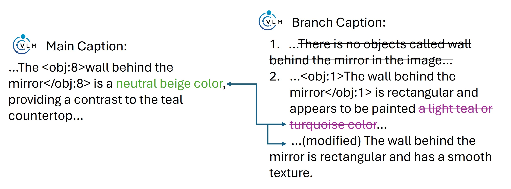
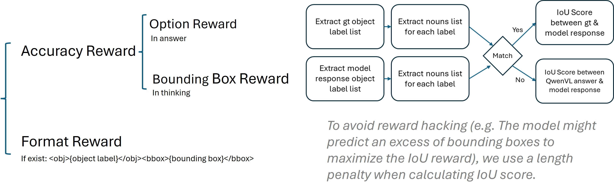
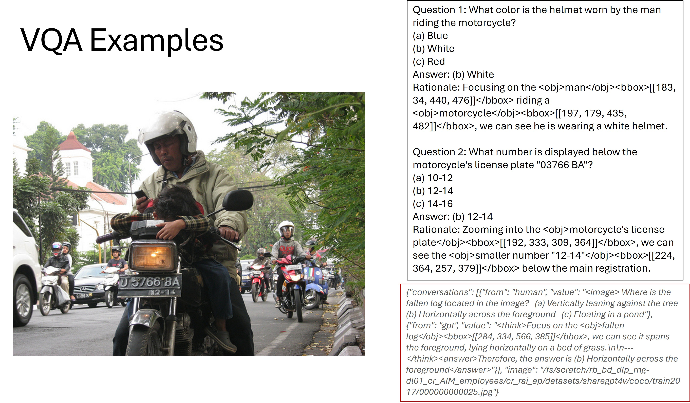

Welcome to our project blog 👋



## Overview

Vision-Language Models (VLMs) have demonstrated impressive capabilities in general image description and question answering. However, a persistent challenge remains: **Visual Grounding**. Models often hallucinate objects or fail to precisely localize the regions they are describing, leading to disconnected reasoning where the text output does not align with the visual evidence. In this project, conducted during my research internship at Bosch (China) Investment Ltd., we addressed these limitations by developing a comprehensive system for high-fidelity VLM training. Our approach focuses on two critical pillars: generating fine-grained, hallucination-free training data and enforcing strict spatial reasoning through Reinforcement Learning (RL).

### The Core Problem

Standard image-caption datasets often lack the granularity required for dense visual grounding. Furthermore, when VLMs attempt to reason, they frequently skip the intermediate "thinking" steps required to locate an object before describing it. To bridge this gap, we needed a pipeline that could:

1. Automatically generate high-quality, localized captions.
2. Train the model to explicitly output bounding boxes during its reasoning process (Chain-of-Thought).

## Solution Part 1: The Data Pipeline

To create a robust training dataset, we designed a **distillation-based pipeline** utilizing a "Two-Level Grounding" strategy. This method moves beyond global image captions to focus on specific regions of interest.

### Two-Level Grounding & Zoom-In Strategy

We implemented a novel crop & zoom-in strategy to enhance visual details. By detecting objects and creating "branch captions" for specific crops, we force the teacher model to focus on fine-grained attributes that might be missed in a global view.

As illustrated above, the pipeline operates by:

* **Level 1 (Main Caption):** Generating a description of the full image.
* **Level 2 (Branch Caption):** Zooming into specific regions (e.g., the white ceramic vase or the bouquet) to generate detailed descriptions.
* **Synthesis:** Integrating these localized insights back into a structured data format (JSON) linking objects `<obj>` to their relationships.

### Eliminating Hallucination

A major issue with synthetic data is quality. To ensure the training data was reliable, we employed a verification stage using a Large Language Model (Qwen3-32B). This step filters out hallucinations where the Vision Model describes objects not actually present in the crop.

For example, if a model incorrectly identifies a "wall behind the mirror" in a specific crop, our verification pipeline modifies or rejects the caption to ensure factual consistency before it reaches the training set.

## Solution Part 2: Reward Design & RL

Data alone is not enough; the model must learn *how* to think. We utilized a **Reinforcement Learning (RL)** approach, specifically adapting **Group Relative Policy Optimization (GRPO)**, to supervise the model's Chain-of-Thought (CoT).

### Reward Formulation

Unlike traditional VQA training that only supervises the final answer, our method supervises the reasoning process. We define a composite reward function $R$ that encourages the model to ground its reasoning visually. The total reward is calculated as:

$$
R_{total} = R_{format} + R_{accuracy} + R_{bbox}
$$

Where:

* **$R_{format}$ (Format Reward):** Ensures the model adheres to the specific syntax `<obj>{label}</obj><bbox>{coordinates}</bbox>`.
* **$R_{accuracy}$ (Option Reward):** Checks if the final chosen answer matches the ground truth.
* **$R_{bbox}$ (Bounding Box Reward):** This is the critical grounding component. We calculate the Intersection over Union (IoU) between the predicted bounding boxes in the "thinking" trace and the ground truth boxes.

To prevent "reward hacking"—where a model might predict an excess of bounding boxes just to maximize overlap—we implement a length penalty within the IoU calculation logic.

## Experimental Results & Analysis

We evaluated the model's performance on complex Visual Question Answering (VQA) tasks. The integration of bounding box supervision into the CoT significantly improved the interpretability of the model's answers.

### Qualitative Analysis

The following example demonstrates the model's capability after training. When asked about the color of a helmet or a license plate number, the model does not simply guess.

As shown in the logic trace (Rationale), the model explicitly localizes the object first:

> "Focusing on the `<obj>`man`</obj>` `<bbox>`...`</bbox>` riding a `<obj>`motorcycle`</obj>`..."

This explicitly demonstrates that the answer "White" is derived from specific pixels in the image, validating our hypothesis that forced grounding improves reasoning reliability.

## Challenges & Future Work

While the results are promising, there are limitations to this approach, often referred to as "The Bitter Lesson" in AI research. Relying on structured, human-defined Chain-of-Thought rules imposes a bias on how we *think* the model should reason, which may not always align with optimal machine representations.

Future directions for this research include:

1. **Spatial Relationship QA:** Expanding the prompt engineering to create QA pairs specifically regarding spatial relationships (e.g., "left of," "behind").
2. **Less Constrained Thinking:** Investigating methods where the model learns its own optimal reasoning format rather than adhering to rigid rule-based CoT structures.

---

<link rel="stylesheet" href="/css/dynamic-background.css">

